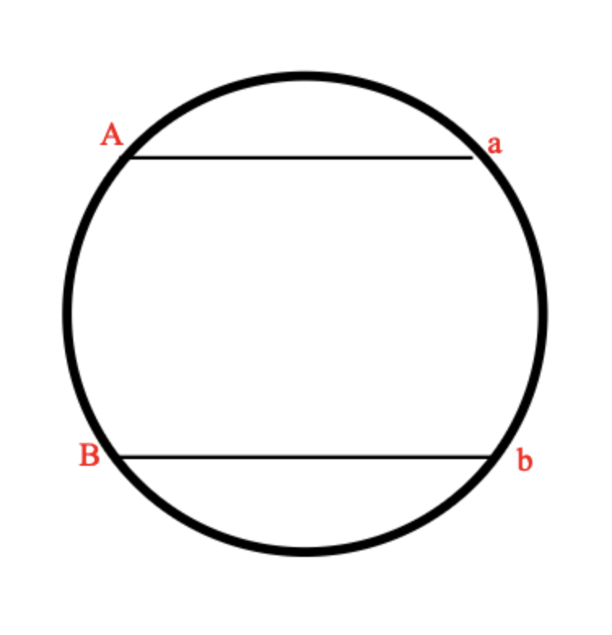

# [A. Агроном-любитель](./task_A.cpp)

<table>
<tr>
    <td>Ограничение времени</td>
    <td>2 секунды</td>
</tr>
<tr>
    <td>Ограничение памяти</td>
    <td>64Mb</td>
</tr>
<tr>
<td>Ввод</td>
<td>стандартный ввод или agro.in</td>
</tr>
<tr>
<td>Вывод</td>
<td>стандартный вывод или agro.out</td>
</tr>
</table>

Городской школьник Лёша поехал на лето в деревню и занялся выращиванием цветов. Он посадил _n_ цветков вдоль одной
длинной прямой грядки, и они успешно выросли. Лёша посадил множество различных видов цветков, _i_-й от начала грядки
цветок имеет вид _ai_, где _ai_ — целое число, номер соответствующего вида в «Каталоге юного
агронома».

Теперь Лёша хочет сделать фотографию выращенных им цветов и выложить ее в раздел «мои грядки» в социальной сети для
агрономов «ВКомпосте». На фотографии будет виден отрезок из одного или нескольких высаженных подряд цветков.

Однако он заметил, что фотография смотрится не очень интересно, если на ней много одинаковых цветков подряд. Лёша решил,
что если на фотографии будут видны три цветка одного вида, высаженные подряд, то его друзья — специалисты по эстетике
цветочных фотографий — поставят мало лайков.

Помогите ему выбрать для фотографирования как можно более длинный участок своей грядки, на котором нет трех цветков
одного вида подряд.

## Формат ввода

В первой строке содержится целое число _n (1 ≤ n ≤ 200 000)_ — количество цветов на грядке.

Во второй строке содержится _n_ целых чисел _ai_ _(1 ≤ ai ≤ 109)_, обозначающих вид
очередного цветка. Одинаковые цветки обозначаются одинаковыми числами, разные — разными.

## Формат вывода

Выведите номер первого и последнего цветка на самом длинном искомом участке. Цветки нумерются от 1 до _n_.

Если самых длинных участков несколько, выведите участок, который начинается раньше.

## Пример

Ввод | Вывод
--- | ---
6  5 6 6 6 23 9 | 3 6

# [B. Зоопарк Глеба](./task_B.cpp)

<table>
<tr>
    <td>Ограничение времени</td>
    <td>1 секунда</td>
</tr>
<tr>
    <td>Ограничение памяти</td>
    <td>256Mb</td>
</tr>
<tr>
<td>Ввод</td>
<td>стандартный ввод или input.txt</td>
</tr>
<tr>
<td>Вывод</td>
<td>стандартный вывод или output.txt</td>
</tr>
</table>

Недавно Глеб открыл зоопарк. Он решил построить его в форме круга и, естественно, обнёс забором. Глеб взял вас туда начальником охраны. Казалось бы все началось так хорошо, но именно в вашу первую смену все животные разбежались. В зоопарке _n_ животных различных видов, также под каждый из видов есть свои ловушки. К сожалению некоторые животные враждуют с друг другом в природе (они обозначены разными буквами), а зоопарк обнесён забором и имеет форму круга. С помощью камер, удалось выяснить, где находятся все животные. Умная система поддержки жизнедеятельности зоопарка уже просканировала зоопарк и вывела id всех животных и ловушек в том порядке, в котором они видны из центра зоопарка. Получилось так, что все животные и все ловушки находятся на краю зоопарка. Вы хотите понять, могут ли животные прийти в свою ловушку так, чтобы их путь не пересекался с другими. Если да, также предъявите какую-нибудь из схем поимки животных.

## Формат ввода
На вход подается строчка из _2 ⋅ n_ символов латинского алфавита, где маленькая буква - животное, а большая - ловушка. Размер строки не более _100000_.

## Формат вывода
Требуется вывести "Impossible", если решения не существует или "Possible", если можно вернуть всех животных в клетки. В случае если можно, то для каждой ловушки в порядке обхода требуется вывести индекс животного в ней.

## Пример 1

Ввод | Вывод
--- | ---
ABba | Possible   2 1

## Пример 2

Ввод | Вывод
--- | ---
ABab | Impossible

## Примечания

Первый пример:   Животное b идёт в ловушку B, а животное a ловится в ловушку A. Их пути не пересекаются, поэтому

Второй пример:   Пути животных пересекаются, поэтому поймать их невозможно

# [C. Конфигурационный файл](./task_C.cpp)

<table>
<tr>
    <td>Ограничение времени</td>
    <td>1 секунда</td>
</tr>
<tr>
    <td>Ограничение памяти</td>
    <td>64Mb</td>
</tr>
<tr>
<td>Ввод</td>
<td>стандартный ввод или input.txt</td>
</tr>
<tr>
<td>Вывод</td>
<td>стандартный вывод или output.txt</td>
</tr>
</table>

Вадим разрабатывает парсер конфигурационных файлов для своего проекта. Файл состоит из блоков, которые выделяются с помощью символов «{» — начало блока, и «}» — конец блока. Блоки могут вкладываться друг в друга. В один блок может быть вложено несколько других блоков.

В конфигурационном файле встречаются переменные. Каждая переменная имеет имя, которое состоит из не более чем десяти строчных букв латинского алфавита. Переменным можно присваивать числовые значения. Изначально все переменные имеют значение _0_.

Присваивание нового значения записывается как _<_variable_>=<_number_>_, где _<_variable_>_ — имя переменной, а _<_number_>_ — целое число, по модулю не превосходящее _109_. Парсер читает конфигурационный файл построчно. Как только он встречает выражение присваивания, он присваивает новое значение переменной. Это значение сохраняется до конца текущего блока, а затем восстанавливается старое значение переменной. Если в блок вложены другие блоки, то внутри тех из них, которые идут после присваивания, значение переменной также будет новым.

Кроме того, в конфигурационном файле можно присваивать переменной значение другой переменной. Это действие записывается как _<_variable1_>=<_variable2_>_. Прочитав такую строку, парсер присваивает текущее значение переменной _variable2_ переменной _variable1_. Как и в случае присваивания константного значения, новое значение сохраняется только до конца текущего блока. После окончания блока переменной возвращается значение, которое было перед началом блока.

Для отладки Вадим хочет напечатать присваиваемое значение для каждой строки вида _<_variable1_>=<_variable2_>_. Помогите ему отладить парсер.

## Формат ввода

Входные данные содержат хотя бы одну и не более _105_ строк. Каждая строка имеет один из четырех типов:

- { — начало блока;
- } — конец блока;
- _<_variable_>=<_number_>_ — присваивание переменной значения, заданного числом;
- _<_variable1_>=<_variable2_>_ — присваивание одной переменной значения другой переменной. Переменные _<_variable1_>_ и _<_variable2_>_ могут совпадать.

Гарантируется, что ввод является корректным и соответствует описанию из условия. Ввод не содержит пробелов.

## Формат вывода

Для каждой строки типа _<_variable1_>=<_variable2_>_ выведите значение, которое было присвоено.

## Пример

Ввод | Вывод
--- | ---
a=b   b=123   var=b   b=-34   {   c=b   b=1000000000   d=b   {   a=b   e=var   }   }   b=b | 0   123   -34   1000000000   1000000000   123   -34

# [D. Профессор Хаос](./task_D.cpp)

<table>
<tr>
    <td>Ограничение времени</td>
    <td>1 секунда</td>
</tr>
<tr>
    <td>Ограничение памяти</td>
    <td>64Mb</td>
</tr>
<tr>
<td>Ввод</td>
<td>стандартный ввод или chaos.in</td>
</tr>
<tr>
<td>Вывод</td>
<td>стандартный вывод или chaos.out</td>
</tr>
</table>

В секретной лаборатории профессора Хаоса проходит эксперимент по выращиванию особо опасных бактерий. В начале первого дня эксперимента у Хаоса имеется _a_ особо опасных бактерий.

Каждый день эксперимента устроен следующим образом. Рано утром профессор достает из контейнера все свои бактерии и помещает их в инкубатор, где бактерии начинают делиться. Вместо каждой бактерии образуется _b_ новых бактерий.

После извлечения бактерий из инкубатора _c_ из них используются для проведения различных опытов и затем уничтожаются. Если после извлечения из инкубатора имеется менее _c_ бактерий, для проведения опытов используются все имеющиеся бактерии, и эксперимент заканчивается.

Оставшиеся бактерии в конце дня необходимо поместить в контейнер и продолжить использовать в эксперименте. Однако в контейнер можно поместить не более _d_ бактерий, поэтому если число оставшихся бактерий больше _d_, то в контейнер помещаются _d_ бактерий, а остальные уничтожаются.

Теперь профессор Хаос хочет выяснить, сколько особо опасных бактерий будет у него в контейнере после _k_-го дня эксперимента. Помогите ему найти ответ на этот вопрос.

## Формат ввода
В единственной строке входного файла содержится пять целых чисел _a_, _b_, _c_, _d_ и _k_ (_1 ≤ a_, _b ≤ 1000_, _0 ≤ c ≤ 1000_, _1 ≤ d ≤ 1000_, _a ≤ d_, _1 ≤ k ≤ 1018_).

## Формат вывода
Выведите одно число — количество бактерий у Хаоса к концу _k_-го дня. Если эксперимент завершится в _k_-й день или ранее, выведите число 0.

## Пример 1

Ввод | Вывод
--- | ---
1 3 1 5 2 | 5

## Пример 2

Ввод | Вывод
--- | ---
1 2 0 4 3 | 4

## Пример 3

Ввод | Вывод
--- | ---
1 2 3 5 2 | 0

# [E. Коровы в стойла](./task_E.cpp)

<table>
<tr>
    <td>Ограничение времени</td>
    <td>0.1 секунда</td>
</tr>
<tr>
    <td>Ограничение памяти</td>
    <td>256Mb</td>
</tr>
<tr>
<td>Ввод</td>
<td>стандартный ввод или input.txt</td>
</tr>
<tr>
<td>Вывод</td>
<td>стандартный вывод или output.txt</td>
</tr>
</table>

На прямой расположены стойла, в которые необходимо расставить коров так, чтобы минимальное расcтояние между коровами было как можно больше.

## Формат ввода
В первой строке вводятся числа _N (2 < N ≤ 105)_ – количество стойл и _K (1 < K < N )_ – количество коров. Во второй строке задаются _N_ натуральных чисел в порядке возрастания – координаты стойл (координаты не превосходят 109).

## Формат вывода
Выведите одно число – наибольшее возможное допустимое расстояние.

## Пример 1

Ввод | Вывод
--- | ---
6 3 2 5 7 11 15 20 | 9

## Пример 2

Ввод | Вывод
--- | ---
5 3 1 2 3 100 1000 | 99

# [F. Число](./task_F.cpp)

<table>
<tr>
    <td>Ограничение времени</td>
    <td>1 секунда</td>
</tr>
<tr>
    <td>Ограничение памяти</td>
    <td>256Mb</td>
</tr>
<tr>
<td>Ввод</td>
<td>стандартный ввод или number.in</td>
</tr>
<tr>
<td>Вывод</td>
<td>стандартный вывод или number.out</td>
</tr>
</table>

Вася написал на длинной полоске бумаги большое число и решил похвастаться своему старшему брату Пете этим достижением. Но только он вышел из комнаты, чтобы позвать брата, как его сестра Катя вбежала в комнату и разрезала полоску бумаги на несколько частей. В результате на каждой части оказалось одна или несколько идущих подряд цифр.

Теперь Вася не может вспомнить, какое именно число он написал. Только помнит, что оно было очень большое. Чтобы утешить младшего брата, Петя решил выяснить, какое максимальное число могло быть написано на полоске бумаги перед разрезанием. Помогите ему!

## Формат ввода
Входной файл содержит одну или более строк, каждая из которых содержит последовательность цифр. Количество строк во входном файле не превышает 100, каждая строка содержит от 1 до 100 цифр. Гарантируется, что хотя бы в одной строке первая цифра отлична от нуля.

## Формат вывода
Выведите в выходной файл одну строку — максимальное число, которое могло быть написано на полоске перед разрезанием.

## Пример 1

Ввод | Вывод
--- | ---
2 20 004 66 | 66220004

## Пример 2

Ввод | Вывод
--- | ---
3 | 3

# [G. Кошмар в замке](./task_G.cpp)

<table>
<tr>
    <td>Ограничение времени</td>
    <td>2 секунды</td>
</tr>
<tr>
    <td>Ограничение памяти</td>
    <td>256Mb</td>
</tr>
<tr>
<td>Ввод</td>
<td>стандартный ввод или aurora.in</td>
</tr>
<tr>
<td>Вывод</td>
<td>стандартный вывод или aurora.out</td>
</tr>
</table>

Ходят легенды, что пока Аврора спала, ей снилось, что она ходит по разным местам: леса, поля, города и сёла. И вот однажды она наткнулась на пещеру, в которой сидел мудрец. Когда мудрец поднял на Аврору глаза, он изрёк: _«Дорогая Аврора! Ты уже годами скитаешься по этим землям. Я хочу предложить тебе задачку. Вот тебе строка s. Каждая буква из алфавита имеет свой вес ci. Вес строки, которую ты можешь получить из s многократным обменом любых двух букв, вычисляется так: для каждой буквы алфавита посчитай максимальное расстояние между позициями, в которых стоит эта буква и перемножь его с весом этой буквы. Принеси мне строку максимально возможного веса, и я тебе расскажу, в чём смысл жизни»_.

К счастью, когда Аврора уже шла со строкой к мудрецу, её поцеловал Филипп, и Аврора вышла из этого кошмара. Теперь вам предлагается самим окунуться в этот кошмар и решить поставленную задачу.

## Формат ввода
Дана строка, состоящая из строчных букв латинского алфавита _(1 ≤ |s| ≤ 105)_. Следующая строка ввода содержит 26 чисел — веса букв латинского алфавита от «a» до «z», веса неотрицательны и не превосходят _231 - 1_.

## Формат вывода
Выведите строку _s_, в которой переставлены буквы так, чтобы полученный вес был максимально возможным. Если искомых вариантов несколько, выведите любой из них.

## Пример

Ввод | Вывод
--- | ---
lkshrules  0 1 2 3 4 5 6 7 8 9 10 11 12 13 14 15 16 17 18 19 20 21 22 23 24 25 | slkhruels

# [H. Магазин](./task_H.cpp)

<table>
<tr>
    <td>Ограничение времени</td>
    <td>2 секунды</td>
</tr>
<tr>
    <td>Ограничение памяти</td>
    <td>256Mb</td>
</tr>
<tr>
<td>Ввод</td>
<td>стандартный ввод или shop.in</td>
</tr>
<tr>
<td>Вывод</td>
<td>стандартный вывод или shop.out</td>
</tr>
</table>

У Билла большая семья: трое сыновей, девять внуков. И всех надо кормить. Поэтому Билл раз в неделю ходит в магазин.

Однажды Билл пришел в магазин и увидел, что в магазине проводится акция под названием «каждый _k_-й товар бесплатно». Изучив правила акции, Билл выяснил следующее. Пробив на кассе товары, покупатель получает чек. Пусть в чеке _n_ товаров, тогда _n/k_ округленное вниз самых дешевых из них достаются бесплатно.

Например, если в чеке пять товаров за 200, 100, 1000, 400 и 100 рублей, соответственно, и _k = 2_, то бесплатно достаются оба товара по 100 рублей, всего покупатель должен заплатить 1600 рублей.

Билл уже выбрал товары, и направился к кассе, когда сообразил, что товары, которые он хочет купить, можно разбить на несколько чеков, и благодаря этому потратить меньше денег.

Помогите Биллу выяснить, какую минимальную сумму он сможет заплатить за выбранные товары, возможно разбив их на несколько чеков.

## Формат ввода
Первая строка входного файла содержит два целых числа _n, k (1 ≤ n ≤ 100 000, 2 ≤ k ≤ 100)_ — количество товаров, которые хочет купит Билл и параметр акции «каждый _k_-й товар бесплатно».

Следующая строка содержит _n_ целых чисел _ai_ _(1 ≤ ai ≤ 10 000)_ — цены товаров, которые покупает Билл.

## Пример

Ввод | Вывод
--- | ---
5 2 200 100 1000 400 100 | 1300

# [I. Машинки](./task_I.cpp)

<table>
<tr>
    <td>Ограничение времени</td>
    <td>1 секунда</td>
</tr>
<tr>
    <td>Ограничение памяти</td>
    <td>256Mb</td>
</tr>
<tr>
<td>Ввод</td>
<td>стандартный ввод или input.txt</td>
</tr>
<tr>
<td>Вывод</td>
<td>стандартный вывод или output.txt</td>
</tr>
</table>

Петя, которому три года, очень любит играть с машинками. Всего у Пети _N_ различных машинок, которые хранятся на полке шкафа так высоко, что он сам не может до них дотянуться. Одновременно на полу комнаты может находиться не более _K_ машинок. Петя играет с одной из машинок на полу и если он хочет поиграть с другой машинкой, которая также находится на полу, то дотягивается до нее сам. Если же машинка находится на полке, то он обращается за помощью к маме. Мама может достать для Пети машинку с полки и одновременно с этим поставить на полку любую машинку с пола. Мама очень хорошо знает своего ребенка и может предугадать последовательность, в которой Петя захочет играть с машинками. При этом, чтобы не мешать Петиной игре, она хочет совершить как можно меньше операций по подъему машинки с пола, каждый раз правильно выбирая машинку, которую следует убрать на полку. Ваша задача состоит в том, чтобы определить минимальное количество операций. Перед тем, как Петя начал играть, все машинки стоят на полке.

## Формат ввода

В первой строке содержаться три числа _N_, _K_ и _P_ _(1≤ K, N ≤ 100000, 1≤ P ≤ 500000)_. В следующих _P_ строках записаны номера машинок в том порядке, в котором Петя захочет играть с ними.

## Формат вывода

Выведите единственное число: минимальное количество операций, которое надо совершить Петиной маме.

## Пример

Ввод | Вывод
--- | ---
3 2 7 1 2 3 1 3 1 2 | 4

## Примечания
В этой задаче можно использовать STL.

Пояснения к примеру:

Операция 1: снять машинку 1

Операция 2: снять машинку 2

Операция 3: поднять машинку 2 и снять машинку 3

Операция 4: поднять машинку 3 или 1 и снять машинку 2

# [J. Гоблины и очереди](./task_J.cpp)

<table>
<tr>
    <td>Ограничение времени</td>
    <td>0.6 секунд</td>
</tr>
<tr>
    <td>Ограничение памяти</td>
    <td>256Mb</td>
</tr>
<tr>
<td>Ввод</td>
<td>стандартный ввод или input.txt</td>
</tr>
<tr>
<td>Вывод</td>
<td>стандартный вывод или output.txt</td>
</tr>
</table>

Гоблины Мглистых гор очень любят ходить к своим шаманам. Так как гоблинов много, к шаманам часто образуются очень длинные очереди. А поскольку много гоблинов в одном месте быстро образуют шумную толку, которая мешает шаманам проводить сложные медицинские манипуляции, последние решили установить некоторые правила касательно порядка в очереди.

Обычные гоблины при посещении шаманов должны вставать в конец очереди. Привилегированные же гоблины, знающие особый пароль, встают ровно в ее середину, причем при нечетной длине очереди они встают сразу за центром.

Так как гоблины также широко известны своим непочтительным отношением ко всяческим правилам и законам, шаманы попросили вас написать программу, которая бы отслеживала порядок гоблинов в очереди.

## Формат ввода

В первой строке входных данный записано число _N_ _(1 ≤ N ≤ 105)_ - количество запросов. Следующие _N_ строк содержат описание запросов в формате:

- _+ i_ - гоблин с номером _i_ _(1 ≤ i ≤ N)_ встаёт в конец очереди.
- _* i_ - привилегированный гоблин с номером _i_ встает в середину очереди.
- _-_ - первый гоблин из очереди уходит к шаманам. Гарантируется, что на момент такого запроса очередь не пуста.

## Формат вывода

Для каждого запроса типа - программа должна вывести номер гоблина, который должен зайти к шаманам.

## Пример 1

Ввод | Вывод
--- | ---
7 + 1 + 2 - + 3 + 4 - - | 1 2 3

## Пример 2

Ввод | Вывод
--- | ---
2 * 1 + 2 |

# [L. Минимум на отрезке](./task_L.cpp)

<table>
<tr>
    <td>Ограничение времени</td>
    <td>0.5 секунд</td>
</tr>
<tr>
    <td>Ограничение памяти</td>
    <td>256Mb</td>
</tr>
<tr>
<td>Ввод</td>
<td>стандартный ввод или input.txt</td>
</tr>
<tr>
<td>Вывод</td>
<td>стандартный вывод или output.txt</td>
</tr>
</table>

Рассмотрим последовательность целых чисел длины _N_. По ней с шагом _1_ двигается «окно» длины _K_, то есть сначала в «окне» видно первые _K_ чисел, на следующем шаге в «окне» уже будут находиться _K_ чисел, начиная со второго, и так далее до конца последовательности. Требуется для каждого положения «окна» определить минимум в нём.

## Формат ввода

В первой строке входных данных содержатся два числа _N_ и _K_ _(1 ≤ N ≤ 150000, 1 ≤ K ≤ 10000, K ≤ N)_ – длины последовательности и «окна», соответственно. На следующей строке находятся _N_ чисел – сама последовательность. Числа последовательности не превосходят по модулю 105.

## Формат вывода

Выходые данные должны содержать _N - K + 1_ строк – минимумы для каждого положения «окна».

## Пример

Ввод | Вывод
--- | ---
7 3 1 3 2 4 5 3 1 | 1 2 2 3 1

# [N. Свинки-копилки](./task_N.cpp)

<table>
<tr>
    <td>Ограничение времени</td>
    <td>1 секунда</td>
</tr>
<tr>
    <td>Ограничение памяти</td>
    <td>256Mb</td>
</tr>
<tr>
<td>Ввод</td>
<td>стандартный ввод или input.txt</td>
</tr>
<tr>
<td>Вывод</td>
<td>стандартный вывод или output.txt</td>
</tr>
</table>

У Васи есть _n_ свинок-копилок, свинки занумерованы числами от _1_ до _n_. Каждая копилка может быть открыта единственным соответствующим ей ключом или разбита. 
Вася положил ключи в некоторые из копилок (он помнит, какой ключ лежит в какой из копилок). Теперь Вася собрался купить машину, а для этого ему нужно достать деньги из всех копилок. При этом он хочет разбить как можно меньшее количество копилок (ведь ему еще нужно копить деньги на квартиру, дачу, вертолет…). Помогите Васе определить, какое минимальное количество копилок нужно разбить.

## Формат ввода

В первой строке содержится число _n_ — количество свинок-копилок _(1 ≤ n ≤ 100)_. Далее идет _n_ строк с описанием того, где лежит ключ от какой копилки: в _i_-й из этих строк записан номер копилки, в которой находится ключ от _i_-й копилки.

## Формат вывода

Выведите единственное число: минимальное количество копилок, которые необходимо разбить.

## Пример

Ввод | Вывод
--- | ---
4 2 1 2 4 | 2